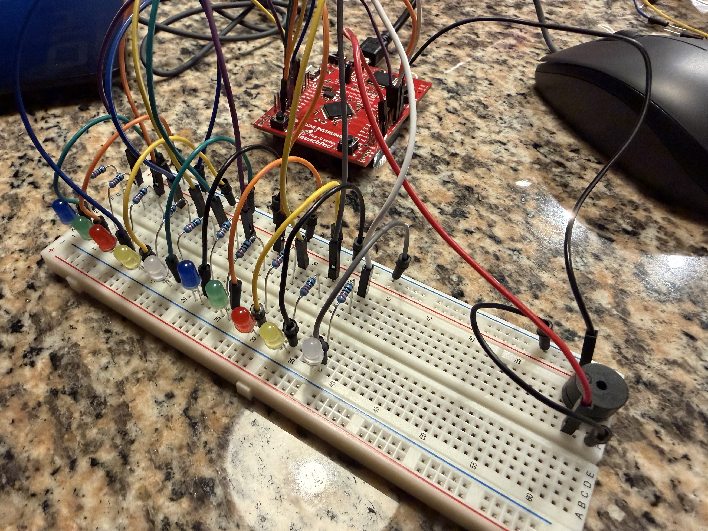
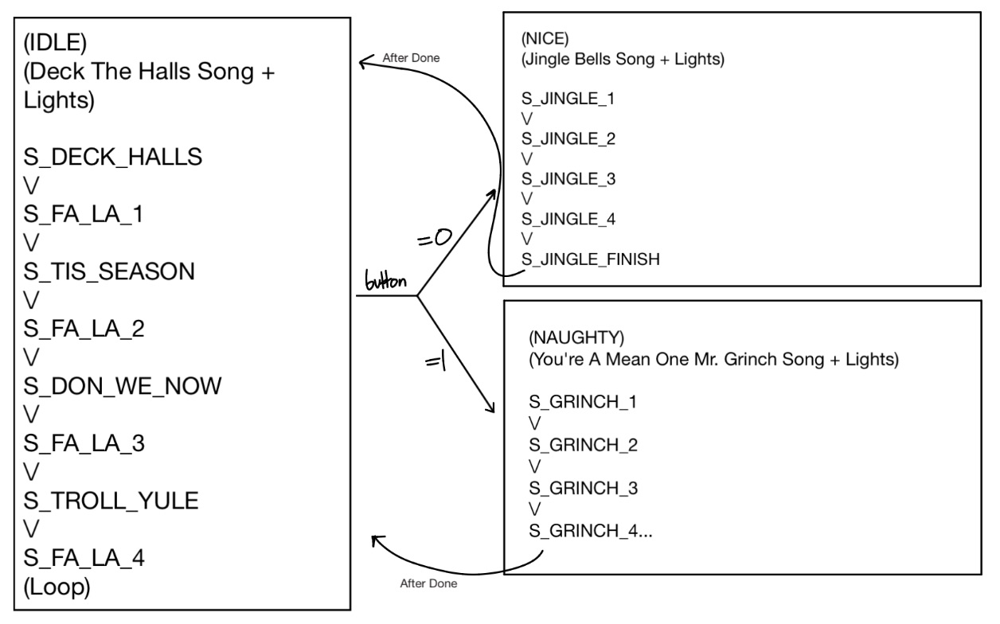

# 🎄 Basic Tiva C Series "Naughty or Nice" Machine

A Christmas-themed embedded systems project built on the Tiva C Series microcontroller featuring synchronized music, LED light shows, `UART` communication, `DMA`, and an `FSM`-driven control system.

Made for the ECE256 (Computer System Interfaces) Final Project

---

## Description

### Requirements

For this project, we had to create a Christmas-themed design capable of playing audio with a synced light show.

The required design elements included:

- `PWM`
- `GPIO`
- `FSM`
- Serial communication (bidirectional `UART`)
- `DMA`

We were also required to deliver:

- A presentation
- Video demos
- A written report

## Basic Hardware Setup

### Wiring

  
   
  <em>The circuit with all of the used components on a breadboard</em>

The setup requires:

- Tiva C Series board (EK-TM4C123GXL)
- Breadboard
- 11 jumper cables
- 12 male-female cables
- Passive buzzer or headphone jack
- 10 220-ohm resistors
- 10 LED lights

The ports used for output are:

- `GND` (ground)
- `PB6` (`PWM` audio)
- `PE0–PE5` (lights)
- `PB0–PB3` (lights)

### Physical Design

  
  
   
  <em>The 3D printed box, and the final circuit inside of it</em>

The Tiva board and breadboard setup were placed inside of a 3D-printed box we created. There is a medium-sized hole in the back of the box to allow for the Tiva board to be connected to power. There are also small holes in the top of the box, allowing the lights to be connected and held at the top of the box.

## Software Design

To start, we used an old `note()` function that utilized `PWM` to play audio, and modified it to also pass a light value through. We set up pins `PB0-PB2` and `PE0-PE5` for light output, and `PB6` for audio output. Then, we created each of the songs using the `note()` function alongside `SysTick` and a light helper function `set_leds()`.  From there, we broke each song down into small sections to be put into the `FSM`.

  
   
  <em>The final FSM design we ended up following</em>

The `FSM` loops through the idle states (The "Deck the Halls" states), until the button is pressed and a quasi-random value function is called. From there the value determines if you are "Naughty" or "Nice" and it plays the corresponding song/light show. After the selected song is over, it returns to looping the idle state.

  
   
  <em>The serial console after hitting the on board button 3 times, then using the "g" key</em>

For the bidirectional `UART` implementation, we allowed the "g", "G", "j", or "J" keys to be hit to send the program to either "Naughty" or "Nice" manually, and we also put in messages when the random value function was activated from the board. We ended up offloading `UART` using the `DMA`.

## Limitations/Possible Improvements:

The biggest possible improvement would be using `DMA` to offload the audio or light show instead of `UART`. `UART` isn't particularly hard on the `CPU`, and adding `DMA` to handle `UART` was overkill. Instead, we could have used it to handle the more intensive tasks like audio or lights. Also, if given more time, we would have expanded audio to sound nicer. We could have implemented a low pass filter in the circuit, as well as using either a sine table or even an R2R ladder setup.

Aesthetically, we lacked the time after 3D printing the box to gift wrap it like we originally intended, and we couldn't secure the Tiva board or breadboard to the box like we had hoped. Additionally, we had to use electrical tape to attach the lights to the holes instead of fixing them in a more sturdy manner. For a fix, the 3D print design could have been modified to hold the light on top but let the ends through.
